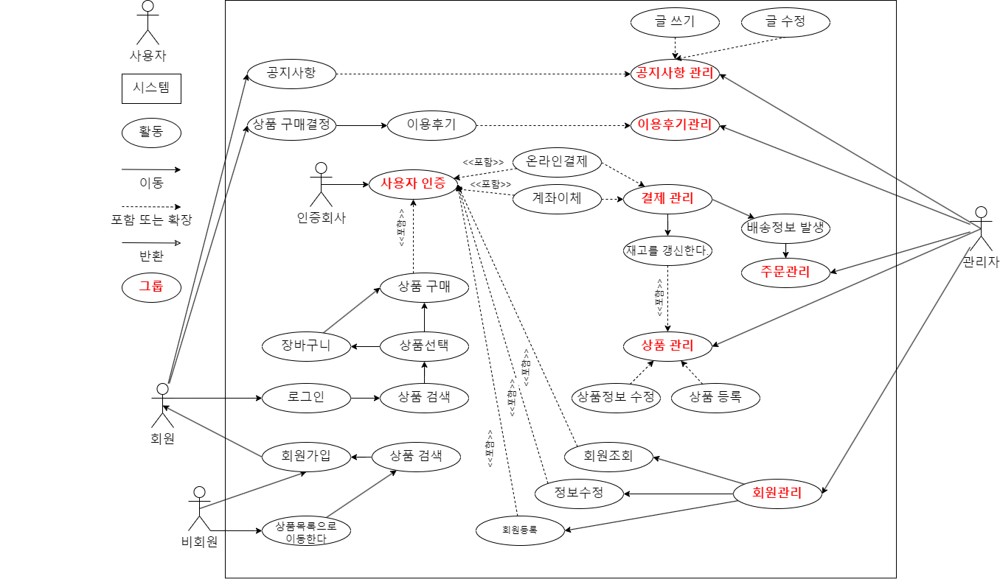
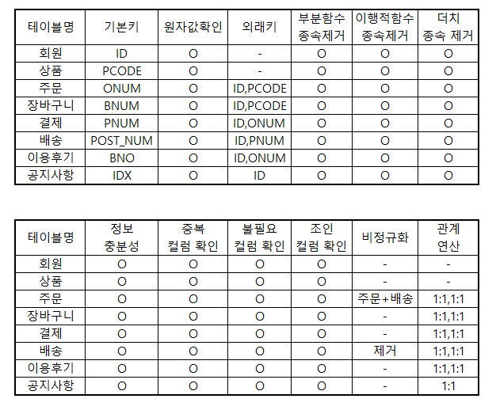
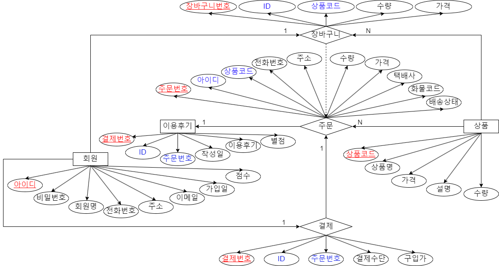
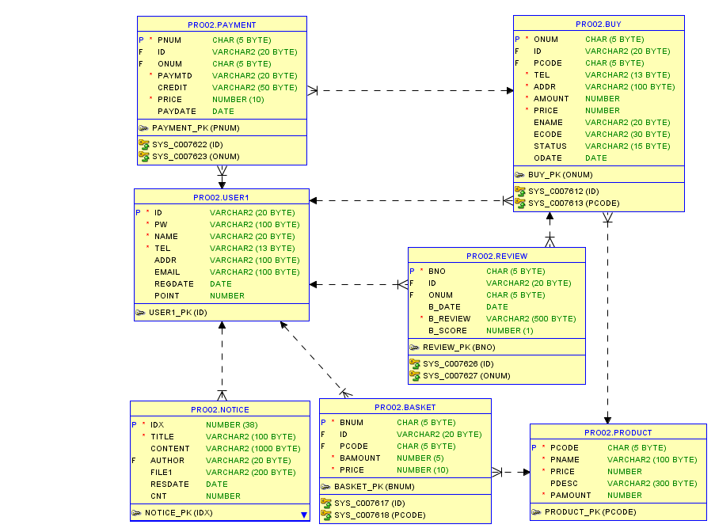
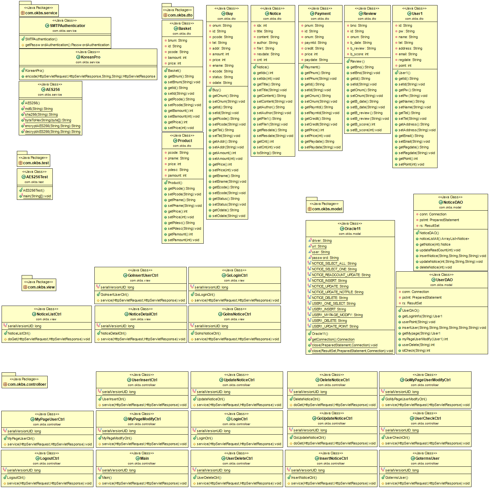
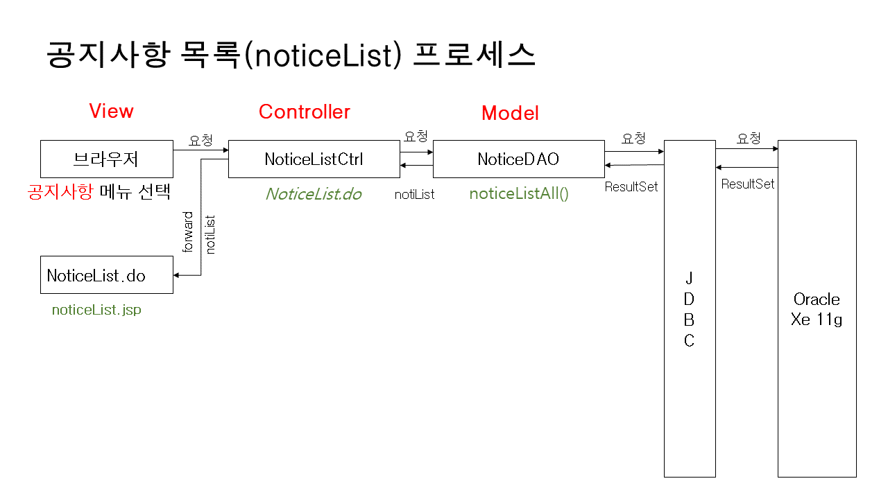
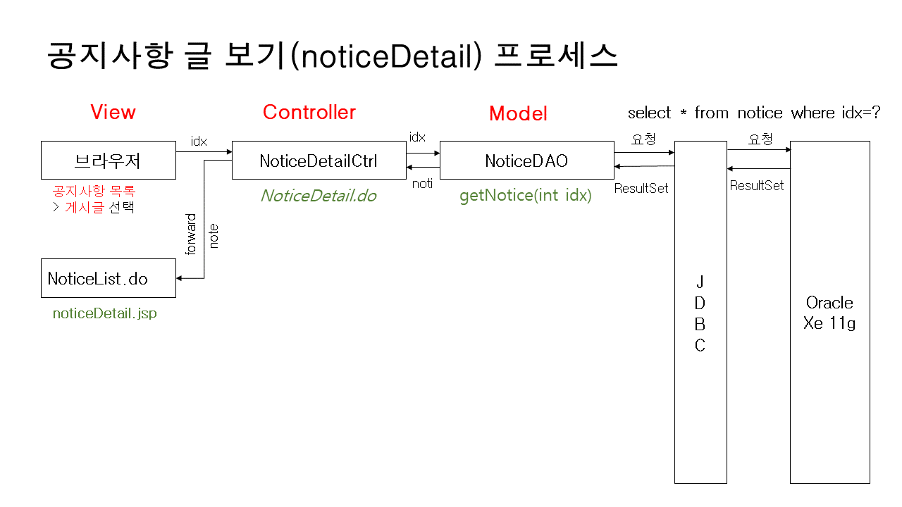
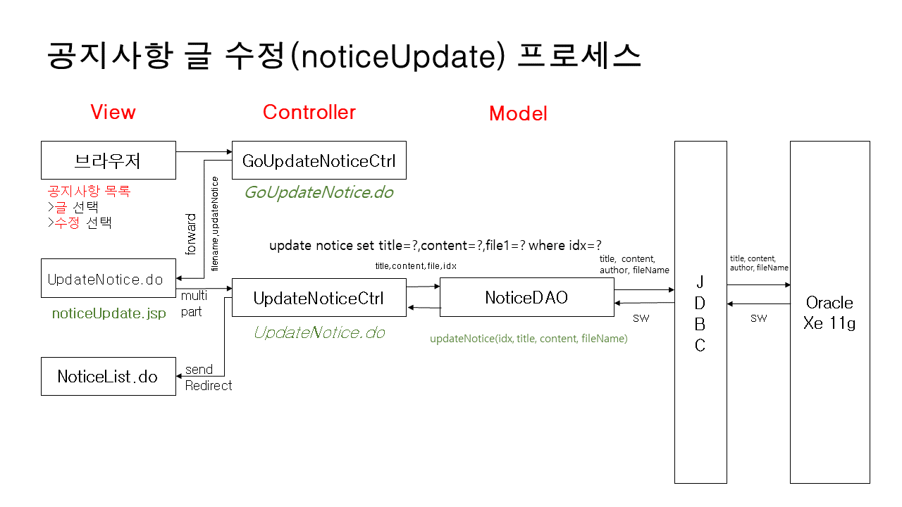
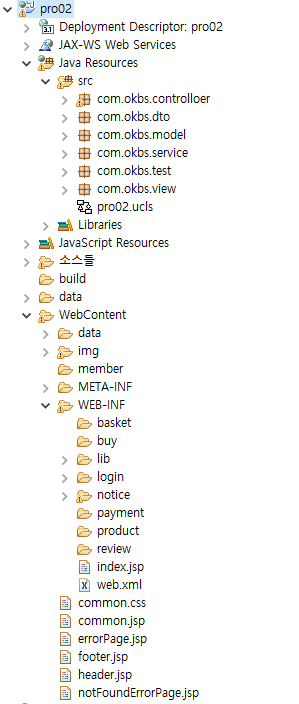

# 프로젝트 개요
## 프로젝트 명 : 소프라노몰
## 프로젝트 기간 : 2023.05.09 ~
## 프로젝트 참여  : 김우주
## JAVA ver : 1.8.0_241
## IDE(통합개발도구) : Eclipse Luna
## JAVA script ver : 1.0
## Dynamic Web Module : 3.1
## DBMS : Oracle 11g xe + Oracle Sql Developer + ANSI SQL Query
## External Library : json , cos , commons , crypto , mail
## JAVA Script Plugin : JQuery
## Css FrameWork : 부트스트랩 3.3.2
## JAVA Script API : DAUM 주소 API , json 데이터 처리 , iamport 결제 api
## 프로젝트 데이터 처리패턴 : MVC2
- View -> Controller > Model > Controller > View

 

## 프로젝트 주요 기능 : 회원 , 공지사항 등

 

## 프로젝트 특이사항
### 회원 가입
- 회원 가입시 회원 약관에 동의해야 회원가입 페이지로 넘어가도록 구현
- 아이디 중복체크 시 json을 이용해 현재 창에서 구현
- 비밀번호는 AES256을 이용하여 암호화 처리하여 저장
- 주소의 입력은 DAUM 주소 API를 활용하여 입력받아 저장

### 공지사항(게시판)
- 관리자계정(admin) 은 모든 글을 수정 및 삭제 가 가능함
- 다른 계정은 자신의 글만 수정 및 삭제가 가능
- 첨부파일 기능을 구현하여 업로드가 가능
- 해당하는 글에 들어가 업로드 되어있는 파일 다운로드 가능

### 상품

- 관리자는 상품 상세페이지에 들어가지않아도 json을 활용해 다른 팝업창 없이 입,출고 기능 구현
- 상품은 썸네일이미지 , 상세페이지 이미지 두가지를 올릴수 있도록 구현
- 상품의 수량이 0 이 되면 품절로 뜨도록 구현
- 출고시 재고량 이상의 값이 빠져나가지 못하도록 구현

### 장바구니
- 상품 상세보기 페이지에서 바로구매 혹은 장바구니 담기가 가능하도록 함
- 장바구니 담기는 json을 활용해 페이지 이동없이 장바구니에 담아지도록 구현
- 장바구니에 담을시 장바구니에 물건이 담겼다는 메세지를 출력하도록 구현 

### 구매
- 구매시 상품의 재고가 같이 빠져나가도록 구현
- 구매시 결제, 구매 정보에 동시에 등록 되도록 구현
- 장바구니에 담았던 상품을 구매시 장바구니목록에서 지워지도록 구현

### 결제
- 결제 기능은 결제 API를 활용하여 구현
- 결제 후 구매 완료를 하면 이용후기가 작성가능
- 배송시스템은 결제 후 이루어진다

### 배송
- 배송시스템은 국내택배만을 취급한다
- 송장번호가 생긴후 송장 조회를 하면 해당 택배사의 조회주소로 연결시켜주도록 구현

### 이용후기
- 구매 완료시 이용후기 작성 혹은 배송 완료 전 이용후기 작성시 구매완료 처리 되도록 구현
- 이용후기는 만족도를 나타낼수 있도록 구현

### QnA
- 질문 및 답변 기능은 해당 상품의 하단에 존재하도록 구현
- 관리자는 회원의 질문 바로 아래쪽에 답변을 달 수 있도록 구현

### 관리자
- 관리자는 회원정보를 수정 , 조회 및 탈퇴 가 가능하여야한다
- 관리자는 상품의 수정 및 삭제가 가능하여야 한다
- 관리자는 회원의 장바구니 수정 조회 삭제 가 가능하여야 한다
- 관리자는 회원의 구매정보를 조회할 수 있어야한다
- 관리자는 회원의 결제 정보를 조회할 수 있어야한다
- 관리자는 회원의 배송정보를 관리할 수 있어야한다
- 관리자는 회원의 이용후기를 관리할 수 있어야한다
- 관리자는 질문및 답변에서 질문 수정은 못하지만 삭제 할 수있어야 하며 그에대한 답변을 달 수 있어야한다

---

# 프로젝트 설계
## 개념적 설계 (유스케이스)
- 유스케이스

---
## 논리적 설계 (검증 표)
- 논리 검증 체크리스트

- 논리적 ERD

---
## 물리적 설계
- 데이터베이스 ERD

---
## 클래스 설계
- 클래스 다이어 그램

---
## 시퀀스 설계
- 시퀀스 설명

---
## 프로젝트 구성
- (리소스구성도)

